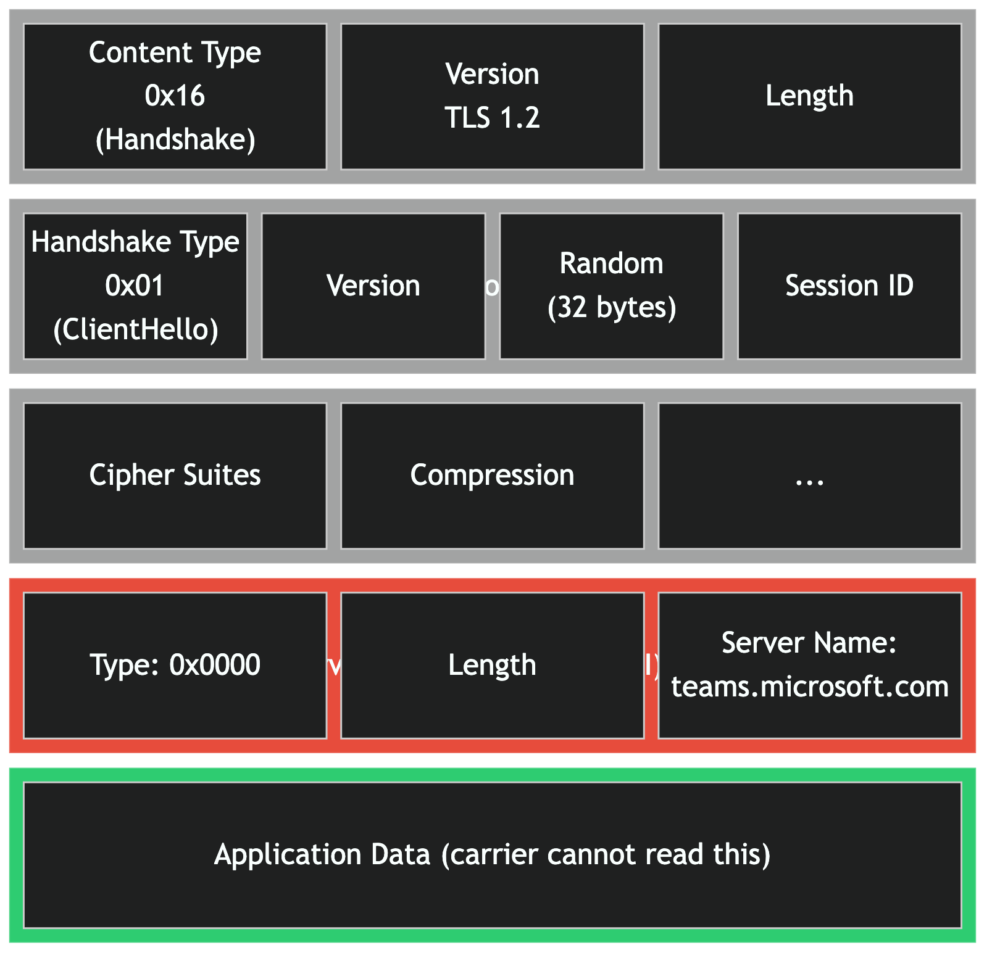
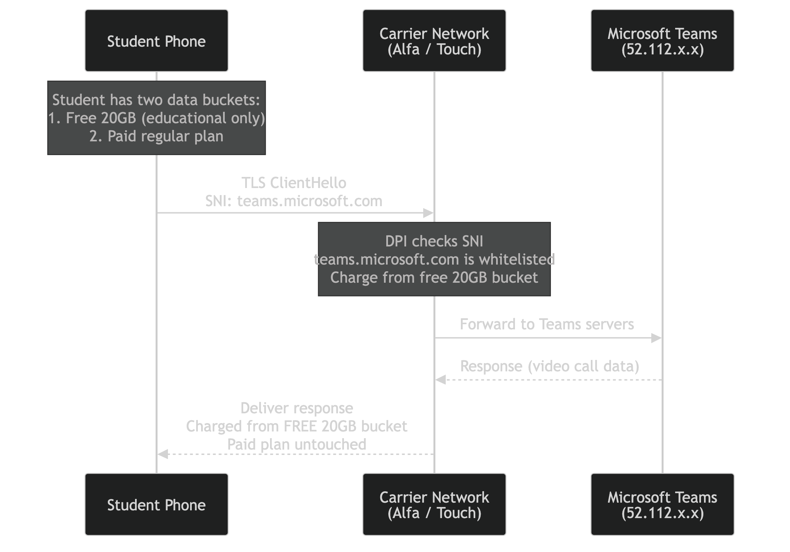
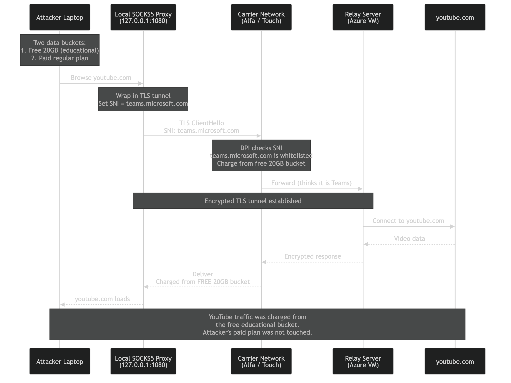
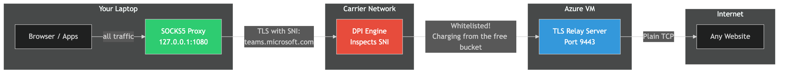
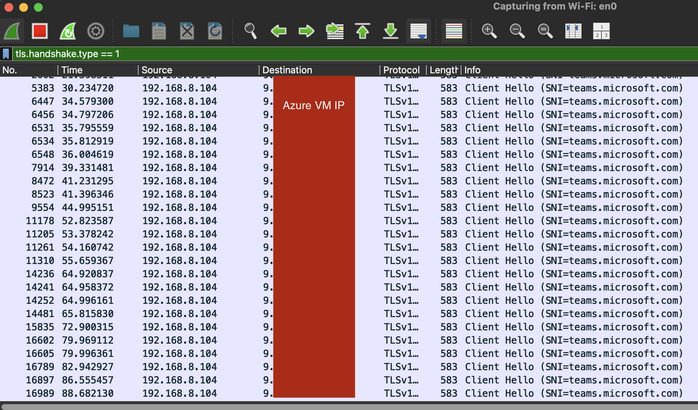

# Lebanon's Free Educational Data Package: Is it only for Teams and Madrasti? Let's see.

Lebanon's telecom companies, Alfa and Touch, recently launched a free 20GB internet package for remote learning. The initiative came amid the worsening displacement crisis in the country, aiming to ease the educational burden on students and teachers.

Here is how it works: every student gets a separate 20GB data bucket, free of charge, available on weekdays from 7:30 AM to 2:00 PM. This bucket can only be used for educational platforms like Microsoft Teams and Madrasati. The student's regular paid data plan is not touched when using these platforms. Any non-educational traffic still gets charged against the paid plan as usual.

The question that nobody asked publicly: how does the carrier decide which bucket to charge?

And that's the goal of this blog, Can we find out if we could trick the carrier into charging non-educational traffic (YouTube, Instagram, anything) from the free 20GB bucket instead of the paid plan. This blog post walks through the method that worked.

## How the Two-Bucket System Works

Every subscriber with this package has two data pools:

1. **Free 20GB bucket** for educational platforms (Teams, Madrasati, etc.), available 7:30 AM to 2:00 PM on weekdays
2. **Paid regular plan** for everything else

When you open Microsoft Teams, the carrier recognizes the traffic and charges it from bucket 1. When you open YouTube, the carrier charges it from bucket 2. The carrier needs a way to tell the difference between the two.

For this to work, the carrier has to look at your traffic and decide: is this person using Teams, or is this person watching cat videos?

## How Carriers Identify Traffic

Your phone does not tell the carrier what app you are using. The carrier has to figure it out by inspecting the traffic as it passes through their network. This is called Deep Packet Inspection, or DPI.

The problem is that almost all internet traffic is encrypted with TLS (the padlock icon in your browser). The carrier cannot read the contents. But there is one piece of information that leaks before encryption kicks in: the **Server Name Indication**, or SNI.

### What is SNI?

When your browser connects to a website over HTTPS, the very first message it sends is called a TLS ClientHello. This message is not encrypted. It contains a field called SNI that tells the server which website you want to talk to.

The reason SNI exists is practical. A single server can host multiple websites. The server needs to know which certificate to present before the encrypted connection is established. So your browser sends the hostname in plaintext, before any encryption happens.

Here is what a TLS ClientHello looks like:



The red section is the SNI extension. It sits right there in the open. Anyone watching the network, including your mobile carrier, can read it.

After the handshake completes, everything becomes encrypted. The carrier can no longer see what you are doing. But they already saw the SNI, and that is enough for them to make a billing decision.

## How the Carrier Routes Traffic to the Right Bucket (Normal Flow)

When a student opens Microsoft Teams on their phone, the following happens:



1. The phone sends a TLS ClientHello with SNI set to `teams.microsoft.com`
2. The carrier's DPI engine sees the SNI and checks it against a whitelist of educational platforms
3. The SNI matches, so the carrier charges this traffic from the free 20GB educational bucket
4. The student's paid data plan is not touched

When the same student opens YouTube, the SNI says `youtube.com`, which is not on the whitelist. That traffic gets charged from the paid plan instead.

This works fine when people are being honest. The problem is that the SNI field is set by the client. Nothing stops you from lying about it.

## The Bypass: SNI Spoofing

The idea is simple. What if you set the SNI to `teams.microsoft.com` but you are not actually connecting to Teams? If the carrier only checks the SNI field to decide which bucket to charge, it would charge the free 20GB educational bucket for all your traffic, regardless of where it is actually going.

To pull this off, you need three things:

1. A **relay server** somewhere on the internet that accepts your connections
2. A **local proxy** on your laptop that wraps all your traffic in a TLS connection with a fake SNI
3. The relay forwards your traffic to the actual destination

The carrier sees a TLS connection with SNI `teams.microsoft.com` and thinks you are in a video call. It charges the traffic from the free 20GB bucket. In reality, you are browsing YouTube, scrolling Instagram, or downloading files. The carrier has no way to tell the difference because everything after the ClientHello is encrypted. Your paid data plan stays untouched.



The overall architecture looks like this:



## What You Need

Before setting up the environment, here is what you need:

- A laptop running macOS, Linux, or Windows
- Python 3.12 or later
- An Azure account with free credits (explained below)
- The toolkit (source code provided)
- A mobile data connection from the target carrier

### Installing Prerequisites

The toolkit needs Python 3.12+, the Azure CLI, and a few other tools. There is an installer script that handles everything for you.

**macOS / Linux:**

```bash
# if you don't have git (or gh CLI / GitHub Desktop)
# click download zip on github
git clone https://github.com/hashseclb/hash-teams-tunnel-toolkit.git
# or you can use SSH (if set up): git clone git@github.com:hashseclb/hash-teams-tunnel-toolkit.git
cd hash-teams-tunnel-toolkit
./install.sh
```

**Windows (PowerShell, run as Administrator):**

```powershell
# if you don't have git (or gh CLI / GitHub Desktop)
# click download zip on github
git clone https://github.com/hashseclb/hash-teams-tunnel-toolkit.git
# or you can use SSH (if set up): git clone git@github.com:hashseclb/hash-teams-tunnel-toolkit.git
cd hash-teams-tunnel-toolkit
Set-ExecutionPolicy -Scope Process -ExecutionPolicy Bypass
.\install.ps1
```

The installer checks what you already have and only installs what is missing. It covers:

- Python 3.13 (via Homebrew on macOS, apt/dnf on Linux, winget on Windows)
- Azure CLI
- uv (Python package manager)
- OpenSSH client (Windows only, if missing)
- Project dependencies

If you prefer to install things manually, here is what you need:

| Tool | macOS | Linux (Ubuntu/Debian) | Windows |
|---|---|---|---|
| Python 3.12+ | `brew install python@3.13` | `sudo apt install python3 python3-pip python3-venv` | `winget install Python.Python.3.13` |
| Azure CLI | `brew install azure-cli` | `curl -sL https://aka.ms/InstallAzureCLIDeb \| sudo bash` | `winget install Microsoft.AzureCLI` |
| uv | `curl -LsSf https://astral.sh/uv/install.sh \| sh` | same as macOS | `irm https://astral.sh/uv/install.ps1 \| iex` |

After installing, log in to Azure:

```bash
az login
```

This opens a browser window where you authenticate. Once done, your terminal is connected to your Azure account.

### Creating an Azure Account with Free Credits

Microsoft gives every new Azure account $200 in free credits that last 30 days. This is more than enough for this test. Here is how to set it up:

1. Go to [azure.microsoft.com/free](https://azure.microsoft.com/free)
2. Click "Start free" and sign in with a Microsoft account (or create one)
3. You will need to provide a credit card for verification, but you will not be charged as long as you stay within the free tier
4. Once your account is active, run `az login` in your terminal

## Running the Bypass (Two Commands)

The toolkit comes with start and stop scripts for each platform. They handle everything: VM creation, relay deployment, tunnel startup, and system proxy configuration.

### Starting

**macOS / Linux:**

```bash
./start.sh
```

**Windows (PowerShell):**

```powershell
.\start.ps1
```

That is it. The script does everything automatically:

1. Checks that Python, Azure CLI, and uv are installed
2. Generates an SSH key (if this is the first run)
3. Installs Python dependencies (if this is the first run)
4. Creates an Azure VM with the relay server (if this is the first run)
5. Starts the relay server on the VM (if not already running)
6. Starts the local SOCKS5 proxy with SNI spoofing
7. Routes all your traffic through the tunnel

If the VM already exists from a previous run, the script reuses it instead of creating a new one.

For USB tethering or a different network interface:

```bash
# macOS / Linux
./start.sh "iPhone USB"

# Windows
.\start.ps1 -Interface "Ethernet"
```

If you are not sure what your interface is called:

```bash
# macOS
networksetup -listallnetworkservices

# Windows (PowerShell)
Get-NetAdapter | Select-Object Name, Status
```

### Stopping

Press `Ctrl+C` in the terminal where the start script is running. It automatically disables the system proxy.

Or from another terminal:

**macOS / Linux:**

```bash
./stop.sh              # Keep VM for next time (no charges while stopped)
./stop.sh --delete     # Delete everything from Azure permanently
```

**Windows:**

```powershell
.\stop.ps1             # Keep VM for next time
.\stop.ps1 -Delete     # Delete everything from Azure permanently
```

### What Happens Under the Hood

When you run the start script, this is the flow:

1. The script creates an Azure VM running Ubuntu in Sweden (takes 2-3 minutes on first run)
2. It copies a small Python relay server to the VM and starts it
3. The relay listens on port 9443 for incoming TLS connections
4. A local SOCKS5 proxy starts on your laptop at `127.0.0.1:1080`
5. Your system proxy is set to route all traffic through this SOCKS5 proxy
6. Every connection going through the proxy is wrapped in a TLS tunnel with SNI set to `teams.microsoft.com`
7. The carrier's DPI sees `teams.microsoft.com` and charges the free 20GB bucket
8. The relay on the Azure VM unwraps the connection and forwards it to the real destination

On Linux, the system proxy is not set automatically. After running `start.sh`, configure it manually:

```bash
export ALL_PROXY=socks5://127.0.0.1:1080
# Or set it in your desktop environment's network settings
```

### Verifying the Tunnel is Working

Once the tunnel is running, the first thing you should do is check that your traffic is actually going through the Azure VM. Open your browser and visit any "what is my IP" website:

- [whatismyipaddress.com](https://whatismyipaddress.com)
- [ifconfig.me](https://ifconfig.me)
- [api.ipify.org](https://api.ipify.org)

The IP address shown should be the Azure VM's IP, not your real IP. If you see the VM's IP, the tunnel is working and all your traffic is being routed through it.

If the IP shown is still your real IP, something is wrong. Common causes:

- The system proxy was not set correctly. Check your network settings and make sure the SOCKS5 proxy is pointing to `127.0.0.1:1080`.
- The browser is ignoring the system proxy. Some browsers (like Firefox) have their own proxy settings. Go to the browser's network settings and set it to use the system proxy, or manually configure a SOCKS5 proxy pointing to `127.0.0.1:1080`.
- On Linux, make sure you set `ALL_PROXY=socks5://127.0.0.1:1080` in the terminal, or configured the proxy in your desktop environment.

## Proving It Works

Saying "the SNI is spoofed" is not enough. You need proof. Here is how to capture the actual packet and show the SNI field.

You need `tshark` (part of Wireshark) installed:

```bash
# macOS
brew install wireshark

# Linux
sudo apt install tshark
```

First, set your VM IP. You can find it in the `.vm_state` file or from the start script output:

```bash
VM_IP=$(cat .vm_state)
echo "VM IP: $VM_IP"
```

Then capture a TLS ClientHello going to the relay. Run these two commands in separate terminals:

**Terminal 1 - start the capture:**

```bash
VM_IP=$(cat .vm_state)
sudo tcpdump -i en0 -c 50 -nn -w /tmp/sni_proof.pcap "host ${VM_IP} and port 9443"
```

Wait until you see `listening on en0` in the output. Do not continue until you see that line.

**Terminal 2 - make the TLS connection:**

```bash
VM_IP=$(cat .vm_state)
python3 << PYEOF
import ssl, socket, time
ctx = ssl.SSLContext(ssl.PROTOCOL_TLS_CLIENT)
ctx.check_hostname = False
ctx.verify_mode = ssl.CERT_NONE
sock = socket.create_connection(('${VM_IP}', 9443), timeout=10)
tls = ctx.wrap_socket(sock, server_hostname='teams.microsoft.com')
tls.send(b'test')
time.sleep(2)
tls.close()
print('TLS connection done')
PYEOF
```

Go back to Terminal 1 and press `Ctrl+C` to stop the capture. Then extract the SNI:

```bash
tshark -r /tmp/sni_proof.pcap \
    -Y "tls.handshake.type == 1" \
    -T fields \
    -e ip.src -e ip.dst -e tcp.dstport \
    -e tls.handshake.extensions_server_name
```

Make sure the tunnel is running (`./start.sh`) before you do this, otherwise the relay on the VM will not be reachable.

The reason we use two terminals is timing. The capture must be running before the TLS connection starts, otherwise it misses the ClientHello (the first packet in the handshake). If you run them in a single terminal with `&`, there is a race condition where the connection can start before the capture is ready.

The output looks like this:

```
172.20.10.8    x.x.x.x    9443    teams.microsoft.com
```

This is the hard proof. The packet going from your laptop to the relay server carries the SNI `teams.microsoft.com` in cleartext. Any DPI engine inspecting traffic on the carrier's network would see this and classify it as Microsoft Teams traffic.

You can also see this visually in Wireshark. Open Wireshark, start capturing on your active interface, and filter with `tls.handshake.type == 1`. Every single TLS ClientHello going to the relay shows `SNI=teams.microsoft.com`, regardless of what website you are actually visiting:



Every row in the capture is a different website request (YouTube, Instagram, Google, etc.), but they all show the same SNI: `teams.microsoft.com`. This is exactly what the carrier's DPI engine sees on their end.

You can also verify it in the raw bytes:

```bash
xxd /tmp/sni_proof.pcap | grep "team"
```

```
00001260: 0016 0000 1374 6561 6d73 2e6d 6963 726f  .....teams.micro
```

There it is. The string `teams.microsoft.com` sitting in the raw packet capture, in plaintext, exactly as the carrier's DPI would see it.

## How the Relay Server Works

The relay server is intentionally simple. It is a Python asyncio server that:

1. Listens for incoming TLS connections on port 9443
2. Uses a self-signed certificate (the carrier cannot tell, because the certificate exchange happens inside the encrypted TLS handshake, after the ClientHello)
3. Reads the destination address from the client
4. Opens a plain TCP connection to the real destination
5. Bridges data between the client and the destination

The server does not care what SNI the client sends. It accepts any SNI value. The spoofing happens entirely on the client side.

The key insight is that the carrier only sees the first message (the ClientHello with the fake SNI). Everything after that is encrypted. The carrier cannot see:

- The self-signed certificate (it is inside the encrypted handshake)
- The destination address the client sends to the relay (inside the encrypted tunnel)
- The actual website content (inside the encrypted tunnel)

## Testing Different SNI Values

Microsoft Teams uses several domains. If one SNI value does not trigger zero-rating, try others:

```bash
# Test with different SNI values
uv run tunnel-test s2 --relay-host $VM_IP --password $PASSWORD \
    --sni teams.microsoft.com --test-mb 1

uv run tunnel-test s2 --relay-host $VM_IP --password $PASSWORD \
    --sni teams.live.com --test-mb 1

uv run tunnel-test s2 --relay-host $VM_IP --password $PASSWORD \
    --sni login.microsoftonline.com --test-mb 1

# Or test all known Teams SNI values automatically
uv run tunnel-test s2 --relay-host $VM_IP --password $PASSWORD \
    --test-all-sni --test-mb 1
```

The toolkit will try each one and report the results.

## Mitigations

If you are the carrier reading this, here is how to fix it.

**1. Correlate SNI with destination IP**

Do not just check the SNI. Also check that the destination IP belongs to Microsoft. If someone sends SNI `teams.microsoft.com` to a random Azure VM or a VPS in Germany, that is suspicious. Microsoft publishes their official IP ranges for Teams at [learn.microsoft.com](https://learn.microsoft.com/en-us/microsoft-365/enterprise/urls-and-ip-address-ranges).

**2. Use the IP ranges, not just the SNI**

Instead of relying on SNI at all, whitelist only the specific IP ranges that Microsoft uses for Teams. This is harder to spoof because the user would need to run their relay on an IP within Microsoft's Teams range (not just any Azure IP).

**3. Monitor for anomalies**

A student using a few GB of Teams traffic during school hours is normal. A student burning through the entire 20GB in one session through a single TLS connection to a non-standard port on an Azure VM is not. Rate limiting and anomaly detection can catch this.

## Conclusion

Using SNI alone to decide which data bucket gets charged is fundamentally fragile. The SNI field was never designed to be a security or billing boundary. It is a plaintext hint sent by the client, and the client can put whatever it wants in there.

This is not a theoretical bypass. The tools are simple, the setup takes 10 minutes, and the only cost is an Azure VM that fits within the free tier. Any technically inclined user with basic networking knowledge could set this up and get 20GB of free general-purpose internet access every month.

The fix is not complicated either. Correlating SNI with destination IP ranges eliminates this bypass vector entirely. Carriers implementing bucket-based billing for specific platforms should treat SNI as one signal among many, not as the sole decision point.

## Questions you should be asking ;)
1- Does the WhatsApp bundle only cover WhatsApp?

2- What is Encrypted Client Hello (ECH)?

---

If you found this useful, give us a star on [GitHub](https://github.com/hashseclb/hash-teams-tunnel-toolkit) and follow [@hashseclb](https://github.com/hashseclb) for more security research.
